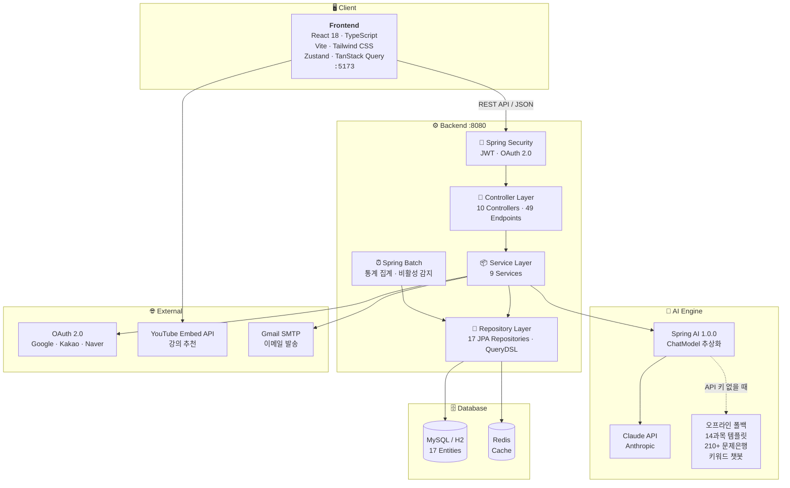
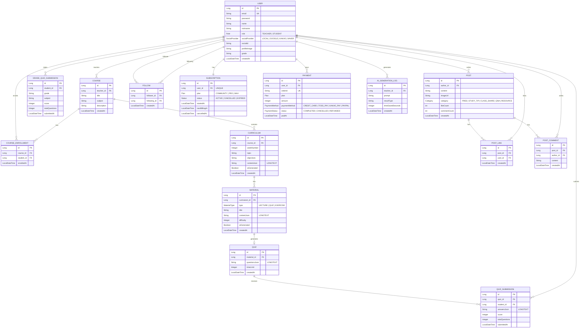
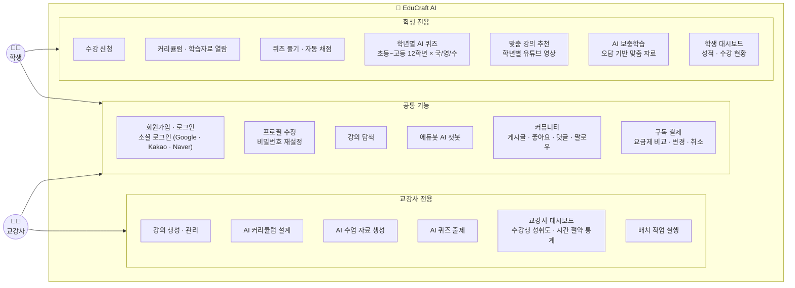

<div align="center">

# EduCraft AI

**AI 기반 맞춤형 교육 플랫폼**

교강사의 수업 준비 시간을 획기적으로 줄이고, 학생에게 학년별 맞춤 학습을 제공하는 차세대 교육 솔루션

[](https://openjdk.org/)
[](https://spring.io/projects/spring-boot)
[](https://react.dev/)
[](https://www.typescriptlang.org/)
[](https://spring.io/projects/spring-ai)
[](https://www.anthropic.com/)
[](LICENSE)

</div>

---

## 목차

- [프로젝트 소개](#프로젝트-소개)
- [핵심 기능](#핵심-기능)
- [기술 스택](#기술-스택)
- [아키텍처](#아키텍처)
- [프로젝트 구조](#프로젝트-구조)
- [실행 방법](#실행-방법)
- [샘플 데이터](#샘플-데이터)
- [API 명세](#api-명세)
- [화면 구성](#화면-구성)

---

## 프로젝트 소개

교육 현장에서 교강사는 강의안 작성, 문제 출제, 커리큘럼 설계 등 **수업 준비에 과도한 시간**을 소모하고, 학생은 자신의 수준에 맞는 학습 자료를 찾기 어렵습니다.

**EduCraft AI**는 이 문제를 해결합니다.

> - 과목과 주제만 입력하면 **AI가 주차별 커리큘럼을 자동 설계**
> - 커리큘럼 기반으로 **강의 자료와 실습 자료를 자동 생성**
> - 학습 목표에 맞는 **퀴즈를 자동 출제**하고 **자동 채점**
> - 학생의 **학년과 과목에 맞는 맞춤 퀴즈** 즉시 풀기
> - **학년별 유튜브 강의 추천**으로 자기주도 학습 지원
> - **AI 챗봇 '에듀봇'**이 학습 질문에 실시간 답변
> - **API 키 없이도** 모든 AI 기능이 **오프라인으로 동작**

---

## 핵심 기능

### 교강사용

| 기능 | 설명 |
|:-----|:-----|
| AI 커리큘럼 설계 | 과목/주제/주차 수/수준 입력 → 주차별 커리큘럼 자동 생성 |
| AI 수업 자료 생성 | 강의자료 / 실습자료 자동 생성 (난이도 조절) |
| AI 퀴즈 출제 | 객관식 + 주관식 문제 자동 생성, 해설 포함 |
| 학생 성취도 대시보드 | 반 전체 & 개별 학생 성적 분석, 시간 절약 통계 |
| 배치 통계 집계 | 일일 학습/AI 사용 통계, 비활성 수강생 자동 감지 |

### 학생용

| 기능 | 설명 |
|:-----|:-----|
| 학년별 AI 퀴즈 | 초등~고등 12학년 x 국/영/수 맞춤 퀴즈 (210+ 문제 내장) |
| 맞춤 강의 추천 | 학년에 맞는 검증된 유튜브 교육 영상 과목별 추천 |
| 온라인 퀴즈 | 퀴즈 응시 → 자동 채점 → 해설 확인 |
| AI 보충 학습 | 틀린 문제 기반 맞춤형 보충 설명 + 추가 연습 문제 |
| 학습 현황 대시보드 | 수강 강의, 퀴즈 점수 (강의+학년별 통합), 평균 성적 |

### 공통

| 기능 | 설명 |
|:-----|:-----|
| 소셜 로그인 | Google / Kakao / Naver (백엔드 프록시 토큰 교환) |
| AI 챗봇 (에듀봇) | 우측 하단 플로팅 위젯, 온/오프라인 학습 질문 답변 |
| 구독 요금제 | Community(무료) / Pro(9,900원) / Max(19,900원) |
| 커뮤니티 피드 | 게시글, 좋아요, 댓글, 팔로우 시스템 |
| 프로필 수정 | 닉네임 변경, 프로필 이미지 업로드/삭제 |
| 아이디/비밀번호 찾기 | 이메일 마스킹 검색, 임시 비밀번호 발급 → 재설정 |

---

## AI 오프라인 폴백

API 키가 없거나 API가 응답하지 않을 때 **내장 템플릿 기반으로 자동 전환**됩니다.

| 기능 | 온라인 (API 키 있음) | 오프라인 (API 키 없음) |
|:-----|:-----|:-----|
| 커리큘럼 생성 | Claude API 맞춤 설계 | 14과목 내장 템플릿 키워드 매칭 |
| 수업 자료 생성 | Claude API 강의/실습 작성 | 3개 섹션 구조화 템플릿 |
| 퀴즈 출제 | Claude API 문제 출제 | 객관식+주관식 혼합 템플릿 |
| 에듀봇 챗봇 | Claude API 실시간 답변 | 14개 카테고리 키워드 매칭 |
| 학년별 퀴즈 | 오프라인 전용 (210+ 문제) | 오프라인 전용 (210+ 문제) |
| 강의 추천 | 오프라인 전용 (유튜브 임베드) | 오프라인 전용 (유튜브 임베드) |

> **내장 템플릿 14과목**: Java OOP, Python, 웹 개발, React, Spring, DB, 자료구조, 알고리즘, C, 모바일, 네트워크, 운영체제, 머신러닝, 수학

---

## 기술 스택

### Backend

| 기술 | 버전 | 용도 |
|:-----|:-----|:-----|
| Java | 17 | 언어 |
| Spring Boot | 3.2.5 | 웹 프레임워크 |
| **Spring AI** | **1.0.0** | **Anthropic Claude 연동 (ChatModel 추상화)** |
| Spring Security | 6.x | 인증/인가 (JWT) |
| Spring Data JPA | 3.x | ORM |
| Spring Batch | 5.x | 배치 작업 (통계 집계) |
| Spring Mail | 3.x | 이메일 발송 (Gmail SMTP) |
| QueryDSL | 5.1.0 | 타입 안전 쿼리 |
| H2 Database | - | 개발용 인메모리 DB |
| MySQL | 8.0 | 운영 DB |
| Redis | 7 | 캐싱 |

### Frontend

| 기술 | 버전 | 용도 |
|:-----|:-----|:-----|
| React | 18 | UI 라이브러리 |
| TypeScript | 5.5 | 타입 안전성 |
| Vite | 5.3 | 빌드 도구 |
| React Router | 6 | 라우팅 |
| TanStack Query | 5 | 서버 상태 관리 |
| Zustand | 4 | 클라이언트 상태 관리 |
| Tailwind CSS | 3.4 | 스타일링 |

### AI & Infra

| 기술 | 용도 |
|:-----|:-----|
| Claude API (Anthropic) | 커리큘럼/자료/퀴즈/보충학습/챗봇 AI 생성 |
| Spring AI ChatModel | Claude API 추상화 (모델 교체 설정만으로 가능) |
| 오프라인 엔진 | 14과목 템플릿 + 210+ 문제 은행 + 키워드 챗봇 |
| YouTube Embed API | 학년별 맞춤 강의 추천 |
| Docker / Nginx | 컨테이너 배포, 리버스 프록시 |

---

## 시스템 아키텍처



---

## ERD (Entity Relationship Diagram)



---

## 유스케이스 다이어그램



---

## 클래스 다이어그램

```mermaid
classDiagram
    direction TB

    class AuthController {
        +register()
        +login()
        +socialLogin()
        +socialLoginWithCode()
        +findEmail()
        +resetPassword()
        +changePassword()
        +getMyInfo()
        +updateProfile()
        +checkEmail()
    }

    class CourseController {
        +createCourse()
        +getMyCourses()
        +browseCourses()
        +getCourse()
        +enrollStudent()
    }

    class CurriculumController {
        +getCurriculums()
        +updateCurriculum()
        +deleteCurriculum()
    }

    class AiController {
        +generateCurriculum()
        +generateMaterial()
        +generateQuiz()
        +generateGradeQuiz()
        +submitGradeQuiz()
        +generateSupplement()
    }

    class ChatController {
        +chat()
    }

    class QuizController {
        +getQuiz()
        +submitQuiz()
        +getQuizResults()
        +getMyResult()
    }

    class DashboardController {
        +getTeacherDashboard()
        +getStudentDashboard()
        +getTimeSaved()
    }

    class SnsController {
        +createPost()
        +getFeed()
        +getFollowingFeed()
        +toggleLike()
        +addComment()
        +toggleFollow()
        +getProfile()
    }

    class SubscriptionController {
        +getMySubscription()
        +subscribe()
        +cancelSubscription()
        +downgradeToFree()
        +getPaymentHistory()
    }

    class BatchController {
        +runJob()
    }

    class AuthService {
        +register()
        +login()
        +getMyInfo()
        +updateProfile()
        +findEmail()
        +resetPassword()
    }

    class SocialAuthService {
        +socialLogin()
        +socialLoginWithCode()
        -getGoogleUserInfo()
        -getKakaoUserInfo()
        -getNaverUserInfo()
    }

    class CourseService {
        +createCourse()
        +getMyCourses()
        +browseAllCourses()
        +getCourse()
        +enrollStudent()
    }

    class CurriculumService {
        +getCurriculums()
        +updateCurriculum()
        +deleteCurriculum()
    }

    class AiGenerationService {
        +generateCurriculum()
        +generateMaterial()
        +generateQuiz()
        +generateGradeQuiz()
        +generateSupplement()
        -generateCurriculumOffline()
        -generateOfflineMaterial()
        -generateOfflineQuiz()
    }

    class QuizService {
        +getQuiz()
        +submitQuiz()
        +getSubmissionResult()
        +getQuizResults()
    }

    class DashboardService {
        +getTeacherDashboard()
        +getStudentDashboard()
        +getTimeSaved()
    }

    class SnsService {
        +createPost()
        +getFeed()
        +toggleLike()
        +addComment()
        +toggleFollow()
        +getProfile()
    }

    class SubscriptionService {
        +getMySubscription()
        +subscribe()
        +cancelSubscription()
        +downgradeToFree()
    }

    class AiClient {
        +isConfigured()
        +generate()
    }

    class JwtTokenProvider {
        +createToken()
        +validateToken()
        +getUserIdFromToken()
    }

    %% Controller → Service
    AuthController --> AuthService
    AuthController --> SocialAuthService
    CourseController --> CourseService
    CurriculumController --> CurriculumService
    AiController --> AiGenerationService
    QuizController --> QuizService
    DashboardController --> DashboardService
    SnsController --> SnsService
    SubscriptionController --> SubscriptionService

    %% Service → Infrastructure
    AiGenerationService --> AiClient
    AuthService --> JwtTokenProvider
    SocialAuthService --> JwtTokenProvider

    %% Service → Repository (simplified)
    AuthService --> UserRepository
    CourseService --> CourseRepository
    CourseService --> CourseEnrollmentRepository
    CurriculumService --> CurriculumRepository
    AiGenerationService --> CurriculumRepository
    AiGenerationService --> MaterialRepository
    AiGenerationService --> QuizRepository
    QuizService --> QuizRepository
    QuizService --> QuizSubmissionRepository
    DashboardService --> CourseRepository
    SnsService --> PostRepository
    SubscriptionService --> SubscriptionRepository

    class UserRepository { }
    class CourseRepository { }
    class CourseEnrollmentRepository { }
    class CurriculumRepository { }
    class MaterialRepository { }
    class QuizRepository { }
    class QuizSubmissionRepository { }
    class PostRepository { }
    class SubscriptionRepository { }

    <<interface>> UserRepository
    <<interface>> CourseRepository
    <<interface>> CourseEnrollmentRepository
    <<interface>> CurriculumRepository
    <<interface>> MaterialRepository
    <<interface>> QuizRepository
    <<interface>> QuizSubmissionRepository
    <<interface>> PostRepository
    <<interface>> SubscriptionRepository
```



---

## 프로젝트 구조

```
EduCraft-AI/
├── docker-compose.yml
│
├── backend/
│   ├── build.gradle
│   ├── Dockerfile
│   └── src/main/java/com/educraftai/
│       ├── domain/
│       │   ├── user/           # 회원 (회원가입, 로그인, 소셜로그인, 학년 등록)
│       │   ├── course/         # 강의 (생성, 수강신청, 탐색)
│       │   ├── curriculum/     # 커리큘럼 (CRUD)
│       │   ├── material/       # 수업 자료
│       │   ├── quiz/           # 퀴즈 (출제, 응시, 채점, 학년별 퀴즈)
│       │   ├── sns/            # SNS (게시글, 좋아요, 댓글, 팔로우)
│       │   ├── ai/             # AI 생성 (커리큘럼/자료/퀴즈/챗봇)
│       │   ├── subscription/   # 구독 & 결제
│       │   ├── batch/          # Spring Batch (통계 집계)
│       │   └── dashboard/      # 대시보드 (통합 통계)
│       ├── global/
│       │   ├── common/         # 공통 응답, 이메일 발송
│       │   ├── config/         # DataInitializer (샘플 데이터)
│       │   ├── exception/      # 예외 처리
│       │   └── security/       # JWT, Security 설정
│       └── infra/
│           └── ai/             # Spring AI ChatModel 설정, 오프라인 템플릿
│
└── frontend/
    ├── package.json
    ├── Dockerfile
    └── src/
        ├── api/                # Axios 클라이언트
        ├── stores/             # Zustand 상태 관리
        ├── components/         # 공통 컴포넌트 (Layout, ChatBot)
        └── pages/
            ├── auth/           # 로그인, 회원가입, 소셜, 프로필
            ├── dashboard/      # 교강사/학생 대시보드
            ├── course/         # 강의 목록, 탐색, 상세
            ├── curriculum/     # AI 커리큘럼 생성
            ├── material/       # AI 자료 생성
            ├── quiz/           # AI 퀴즈, 학년별 퀴즈
            ├── recommend/      # 유튜브 강의 추천
            ├── subscription/   # 요금제 & 결제
            └── sns/            # 커뮤니티 피드, 프로필
```

---

## 실행 방법

### 사전 요구사항

- Java 17+
- Node.js 18+
- Docker & Docker Compose (배포 시)
- Anthropic API Key **(선택)** — 없어도 오프라인 모드로 동작

### 로컬 개발 환경

```bash
# 1. 저장소 클론
git clone https://github.com/GEONHO96/EduCraft-AI.git
cd EduCraft-AI

# 2. 백엔드 실행 (H2 인메모리 DB, 샘플 데이터 자동 생성)
cd backend
./gradlew bootRun

# AI 온라인 모드 사용 시:
# AI_API_KEY=sk-ant-... ./gradlew bootRun

# 3. 프론트엔드 실행 (새 터미널)
cd frontend
cp .env.example .env    # 소셜 로그인 Client ID 입력
npm install
npm run dev
```

| 서비스 | URL |
|:-------|:----|
| 프론트엔드 | http://localhost:5173 |
| 백엔드 API | http://localhost:8080 |
| H2 Console | http://localhost:8080/h2-console |

### Docker 배포

```bash
# 환경변수 설정 (선택)
export AI_API_KEY=your-anthropic-api-key

# 실행
docker-compose up --build
```

### 환경변수

<details>
<summary><b>백엔드 환경변수</b></summary>

| 변수 | 용도 | 필수 |
|:-----|:-----|:-----|
| `AI_API_KEY` | Anthropic Claude API 키 | 선택 |
| `MAIL_USERNAME` | Gmail 계정 (이메일 발송) | 선택 |
| `MAIL_PASSWORD` | Gmail 앱 비밀번호 | 선택 |

`application.yml` 소셜 로그인 설정:
```yaml
social:
  naver:
    client-id: your-naver-client-id
    client-secret: your-naver-client-secret
  kakao:
    client-id: your-kakao-client-id
```

</details>

<details>
<summary><b>프론트엔드 환경변수 (frontend/.env)</b></summary>

```env
VITE_API_URL=http://localhost:8080/api
VITE_GOOGLE_CLIENT_ID=your-google-client-id
VITE_KAKAO_CLIENT_ID=your-kakao-client-id
VITE_NAVER_CLIENT_ID=your-naver-client-id
```

</details>

<details>
<summary><b>소셜 로그인 OAuth 설정 가이드</b></summary>

**Google**
1. [Google Cloud Console](https://console.cloud.google.com/) → OAuth 클라이언트 ID 생성
2. JavaScript 원본: `http://localhost:5173`
3. 리디렉션 URI: `http://localhost:5173/auth/google/callback`

**Kakao**
1. [Kakao Developers](https://developers.kakao.com/) → 앱 생성 → 카카오 로그인 활성화
2. Redirect URI: `http://localhost:5173/auth/kakao/callback`
3. REST API 키를 프론트엔드 + 백엔드 모두 설정

**Naver**
1. [NAVER Developers](https://developers.naver.com/) → 네이버 로그인 API 등록
2. 서비스 URL: `http://localhost:5173`
3. Callback URL: `http://localhost:5173/auth/naver/callback`
4. **이메일 주소** 권한을 **필수**로 설정

> Naver/Kakao는 브라우저 CORS 차단으로 인해 **백엔드 프록시**로 토큰을 교환합니다.

</details>

---

## 샘플 데이터

서버 시작 시 `DataInitializer`가 자동으로 샘플 데이터를 생성합니다 (local 프로필).

### 계정

| 역할 | 이메일 | 비밀번호 | 이름 | 담당/학년 |
|:-----|:-------|:---------|:-----|:----------|
| 교강사 | kim@edu.com | 1234 | 김수학 | 수학 |
| 교강사 | lee@edu.com | 1234 | 이영어 | 영어 |
| 교강사 | park@edu.com | 1234 | 박과학 | 과학 |
| 교강사 | choi@edu.com | 1234 | 최국어 | 국어 |
| 교강사 | jung@edu.com | 1234 | 정코딩 | 프로그래밍 |
| 학생 | student1@edu.com | 1234 | 홍길동 | 중1 |
| 학생 | student2@edu.com | 1234 | 김영희 | 고2 |
| 학생 | student3@edu.com | 1234 | 이철수 | 초5 |
| 학생 | student4@edu.com | 1234 | 박민준 | 고1 |
| 학생 | student5@edu.com | 1234 | 정서연 | 중2 |

### 콘텐츠 현황

| 항목 | 수량 | 상세 |
|:-----|:-----|:-----|
| 강의 | 17개 | 수학 3 / 영어 3 / 과학 3 / 국어 3 / 프로그래밍 5 |
| 커리큘럼 | 68개 | 강의당 4주차 (주제, 학습 목표, 상세 내용) |
| 학습자료 | 85개 | LECTURE 68 + QUIZ 17 (섹션별 핵심 포인트 포함) |
| 퀴즈 | 17개 | 강의당 종합 퀴즈 (객관식 3~4 + 주관식 1, 해설 포함) |
| 수강신청 | 다수 | 학생별 2~3개 과목 수강 |

### 강의 목록

| 과목 | 강의명 |
|:-----|:-------|
| 수학 | 기초 수학 완성반, 중등 수학 심화, 고등 미적분 입문 |
| 영어 | 왕초보 영어 회화, 영어 문법 마스터, 토익 800+ 달성 전략 |
| 과학 | 재미있는 물리학, 화학 기초 다지기, 생명과학 탐구 |
| 국어 | 국어 독해력 향상, 논술 글쓰기 특강, 한국 문학사 이해 |
| 프로그래밍 | Python 입문, 웹 개발 부트캠프, AI/머신러닝 기초, Java OOP, 알고리즘과 자료구조 |

---

## API 명세

> 총 **49개** 엔드포인트 | 공통 응답: `{ "success": true/false, "data": {...} }`
> 인증: `Authorization: Bearer <JWT>` 헤더 (공개 API 제외)

### 엔드포인트 요약

| 카테고리 | 수 | 주요 엔드포인트 |
|:---------|:---|:----------------|
| 인증 | 10 | 회원가입, 로그인, 소셜로그인, 프로필 수정, 비밀번호 재설정 |
| 강의 | 5 | 강의 CRUD, 탐색, 수강 신청 |
| 커리큘럼 | 3 | 목록 조회, 수정, 삭제 |
| AI 생성 | 6 | 커리큘럼/자료/퀴즈 AI 생성, 학년별 퀴즈, 보충학습 |
| 퀴즈 | 4 | 퀴즈 조회, 제출, 결과 확인 |
| 대시보드 | 3 | 교강사/학생 대시보드, 시간 절약 통계 |
| 배치 | 1 | 배치 작업 수동 실행 |
| SNS | 11 | 게시글 CRUD, 좋아요, 댓글, 팔로우, 프로필 |
| 챗봇 | 1 | 에듀봇 대화 |
| 구독 | 5 | 구독 조회/신청/취소, 결제 내역 |

<details>
<summary><b>1. 인증 API (/api/auth)</b></summary>

#### `POST /api/auth/register` — 회원가입
```json
// Request
{ "email": "student@edu.com", "password": "1234", "name": "홍길동", "role": "STUDENT", "grade": "MIDDLE_1" }

// Response
{ "success": true, "data": { "accessToken": "eyJ...", "user": { "id": 1, "email": "...", "role": "STUDENT" } } }
```

#### `POST /api/auth/login` — 로그인
```json
{ "email": "student@edu.com", "password": "1234" }
```

#### `POST /api/auth/social-login` — 소셜 로그인 (access token)
> Google에서 사용 (implicit flow)
```json
{ "accessToken": "소셜 액세스 토큰", "provider": "GOOGLE", "role": "STUDENT" }
```

#### `POST /api/auth/social-login/code` — 소셜 로그인 (authorization code)
> Kakao, Naver에서 사용 (백엔드 토큰 교환)
```json
{ "code": "auth_code", "state": "csrf_state", "provider": "NAVER", "redirectUri": "http://localhost:5173/auth/naver/callback" }
```

#### 기타
| 메서드 | 경로 | 설명 |
|:-------|:-----|:-----|
| GET | `/api/auth/me` | 내 정보 조회 |
| POST | `/api/auth/find-email` | 아이디 찾기 (이름 → 마스킹 이메일) |
| POST | `/api/auth/reset-password` | 임시 비밀번호 발급 |
| POST | `/api/auth/change-password` | 비밀번호 변경 |
| GET | `/api/auth/check-email` | 이메일 중복 확인 |
| PUT | `/api/auth/profile` | 프로필 수정 (닉네임, 프로필 이미지) |

</details>

<details>
<summary><b>2. 강의 API (/api/courses)</b></summary>

| 메서드 | 경로 | 권한 | 설명 |
|:-------|:-----|:-----|:-----|
| POST | `/api/courses` | 교강사 | 강의 생성 |
| GET | `/api/courses` | 로그인 | 내 강의 목록 |
| GET | `/api/courses/browse` | 로그인 | 전체 강의 탐색 |
| GET | `/api/courses/{id}` | 로그인 | 강의 상세 |
| POST | `/api/courses/{id}/enroll` | 학생 | 수강 신청 |

</details>

<details>
<summary><b>3. 커리큘럼 API (/api)</b></summary>

| 메서드 | 경로 | 권한 | 설명 |
|:-------|:-----|:-----|:-----|
| GET | `/api/courses/{courseId}/curriculums` | 로그인 | 커리큘럼 목록 |
| PUT | `/api/curriculums/{id}` | 교강사 | 커리큘럼 수정 |
| DELETE | `/api/curriculums/{id}` | 교강사 | 커리큘럼 삭제 |

</details>

<details>
<summary><b>4. AI 생성 API (/api/ai)</b></summary>

#### `POST /api/ai/curriculum/generate` — AI 커리큘럼 생성
```json
{ "courseId": 1, "subject": "수학", "topic": "미적분", "totalWeeks": 4, "targetLevel": "초급" }
```

#### `POST /api/ai/material/generate` — AI 수업 자료 생성
```json
{ "curriculumId": 1, "type": "LECTURE", "difficulty": 3 }
```

#### `POST /api/ai/quiz/generate` — AI 퀴즈 생성
```json
{ "curriculumId": 1, "questionCount": 10, "difficulty": 3, "questionTypes": "MULTIPLE_CHOICE,SHORT_ANSWER" }
```

#### `POST /api/ai/quiz/grade-quiz` — 학년별 AI 퀴즈 생성
```json
{ "grade": "MIDDLE_1", "subject": "수학", "questionCount": 5, "difficulty": 3 }
```

| 메서드 | 경로 | 설명 |
|:-------|:-----|:-----|
| POST | `/api/ai/quiz/grade-quiz/submit` | 학년별 퀴즈 결과 저장 |
| POST | `/api/ai/supplement/generate` | AI 보충학습 생성 |

</details>

<details>
<summary><b>5. 퀴즈 API (/api/quizzes)</b></summary>

| 메서드 | 경로 | 권한 | 설명 |
|:-------|:-----|:-----|:-----|
| GET | `/api/quizzes/{id}` | 로그인 | 퀴즈 조회 |
| POST | `/api/quizzes/{id}/submit` | 학생 | 퀴즈 제출 (자동 채점) |
| GET | `/api/quizzes/{id}/results` | 교강사 | 전체 결과 |
| GET | `/api/quizzes/{id}/my-result` | 학생 | 내 결과 |

</details>

<details>
<summary><b>6. 대시보드 API (/api/dashboard)</b></summary>

| 메서드 | 경로 | 권한 | 설명 |
|:-------|:-----|:-----|:-----|
| GET | `/api/dashboard/teacher` | 교강사 | 교강사 대시보드 (강의/수강생/AI 통계) |
| GET | `/api/dashboard/student` | 학생 | 학생 대시보드 (강의+학년별 퀴즈 통합) |
| GET | `/api/dashboard/time-saved` | 교강사 | 시간 절약 통계 |

</details>

<details>
<summary><b>7. SNS 커뮤니티 API (/api/sns)</b></summary>

| 메서드 | 경로 | 설명 |
|:-------|:-----|:-----|
| POST | `/api/sns/posts` | 게시글 작성 (카테고리: FREE, STUDY_TIP, CLASS_SHARE, QNA, RESOURCE) |
| GET | `/api/sns/posts` | 전체 피드 (?page=0&size=10) |
| GET | `/api/sns/posts/following` | 팔로잉 피드 |
| GET | `/api/sns/posts/category/{cat}` | 카테고리별 조회 |
| GET | `/api/sns/posts/{id}` | 게시글 상세 (댓글 포함) |
| DELETE | `/api/sns/posts/{id}` | 게시글 삭제 (작성자) |
| POST | `/api/sns/posts/{id}/like` | 좋아요 토글 |
| POST | `/api/sns/posts/{id}/comments` | 댓글 작성 |
| DELETE | `/api/sns/comments/{id}` | 댓글 삭제 (작성자) |
| POST | `/api/sns/users/{id}/follow` | 팔로우 토글 |
| GET | `/api/sns/users/{id}/profile` | 프로필 조회 |

</details>

<details>
<summary><b>8. 챗봇 & 구독 & 배치 API</b></summary>

#### AI 챗봇
| 메서드 | 경로 | 설명 |
|:-------|:-----|:-----|
| POST | `/api/chat` | 에듀봇 대화 (`offline: true/false` 구분) |

#### 구독 & 결제
| 메서드 | 경로 | 설명 |
|:-------|:-----|:-----|
| GET | `/api/subscription/me` | 현재 구독 상태 |
| GET | `/api/subscription/payments` | 결제 내역 |
| POST | `/api/subscription/subscribe` | 구독 신청 (결제) |
| POST | `/api/subscription/cancel` | 구독 취소 |
| POST | `/api/subscription/downgrade` | 무료 플랜으로 변경 |

#### 배치
| 메서드 | 경로 | 설명 |
|:-------|:-----|:-----|
| POST | `/api/batch/run/{jobName}` | 수동 실행 (learning-stats, ai-usage-stats, inactive-students) |

</details>

---

## 화면 구성

| 페이지 | 경로 | 설명 |
|:-------|:-----|:-----|
| 로그인 | `/login` | 이메일 + 소셜 로그인 (Google/Kakao/Naver) |
| 회원가입 | `/register` | 역할 선택, 학생은 학년 선택 (초등~고등) |
| 소셜 콜백 | `/auth/:provider/callback` | OAuth 후 역할 선택, 자동 로그인 |
| 계정 찾기 | `/find-account` | 이메일 찾기 / 비밀번호 재설정 (3단계) |
| 대시보드 | `/` | 교강사: 통계+활동 / 학생: 수강+성적 |
| 강의 관리 | `/courses` | 강의 CRUD, 검색, 카드 UI |
| 강의 탐색 | `/courses/browse` | 전체 강의 목록, 수강 신청 |
| 강의 상세 | `/courses/:id` | 커리큘럼, 자료, 퀴즈 관리 |
| AI 커리큘럼 | `/courses/:id/generate-curriculum` | AI 커리큘럼 자동 설계 |
| AI 자료 생성 | `/curriculum/:id/generate-material` | 강의/실습 자료 생성 |
| AI 퀴즈 출제 | `/curriculum/:id/generate-quiz` | 문제 유형/난이도 설정 |
| 퀴즈 풀기 | `/quiz/:id` | 타이머, 진행률, 자동 제출, 해설 |
| 학년별 퀴즈 | `/grade-quiz` | 학년/과목 선택 → 즉시 풀기 |
| 강의 추천 | `/recommend` | 학년별 유튜브 교육 영상 |
| 요금제 | `/pricing` | 플랜 비교, 결제 (3단계 모달) |
| 커뮤니티 | `/sns/feed` | 피드, 카테고리, 좋아요, 댓글 |
| 프로필 수정 | `/profile/edit` | 닉네임, 프로필 이미지 |
| 프로필 | `/sns/profile/:id` | 프로필 카드, 팔로우, 게시글 |
| 에듀봇 | 전체 (우측 하단) | 플로팅 챗봇, 빠른 질문 |

---

## UI/UX 특징

| 항목 | 설명 |
|:-----|:-----|
| 반응형 레이아웃 | 모바일 햄버거 메뉴, 데스크톱 네비게이션 바 |
| 로딩 스켈레톤 | 데이터 로딩 시 콘텐츠 형태 스켈레톤 UI |
| 에러 바운더리 | 컴포넌트 오류 시 앱 크래시 방지, 재시도 버튼 |
| 토스트 알림 | react-hot-toast 기반 즉각적 피드백 |
| 퀴즈 타이머 | 카운트다운 + 색상 변화 + 시간 초과 자동 제출 |
| 학년 자동 선택 | 로그인 시 등록된 학년으로 퀴즈/추천 자동 설정 |
| 점수 색상 구분 | 80+ 초록 / 60+ 노랑 / 60 미만 빨강 |
| AI 챗봇 위젯 | 로봇 캐릭터, 타이핑 인디케이터, 안읽은 메시지 배지 |
| 프로필 이미지 | 호버 카메라 아이콘, 미리보기, 업로드 스피너 |
| 결제 모달 | 3단계 (수단 선택 → 처리 → 완료), 카드번호 자동 포맷팅 |

---

## 차별점

| 항목 | 기존 LMS | EduCraft AI |
|:-----|:---------|:------------|
| 수업 준비 | 교강사 직접 작성 | AI 자동 생성 → 교강사 검수 |
| 문제 출제 | 수동 출제 | AI 자동 출제 + 채점 + 해설 |
| 학생 자습 | 자료 없음 | 학년별 맞춤 퀴즈 + 유튜브 추천 |
| 보충 학습 | 없음 | 오답 기반 맞춤형 보충 자료 |
| AI 도우미 | 없음 | 에듀봇 챗봇 (온/오프라인) |
| 오프라인 지원 | 불가능 | API 키 없이 모든 AI 기능 동작 |
| 효과 측정 | 불가능 | 절약 시간 정량 측정 |

---

## 팀 정보

| 이름 | 역할 |
|:-----|:-----|
| GEONHO96 | Full-Stack 개발 |
